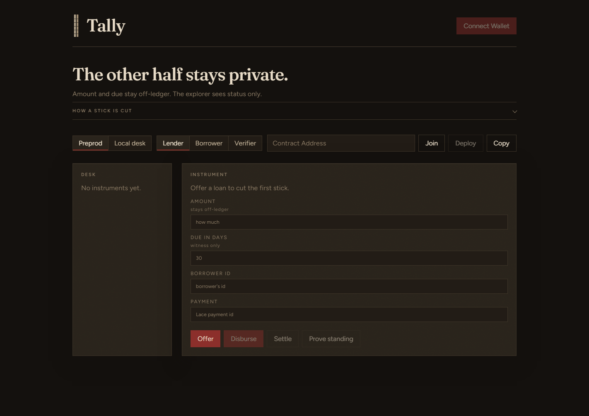
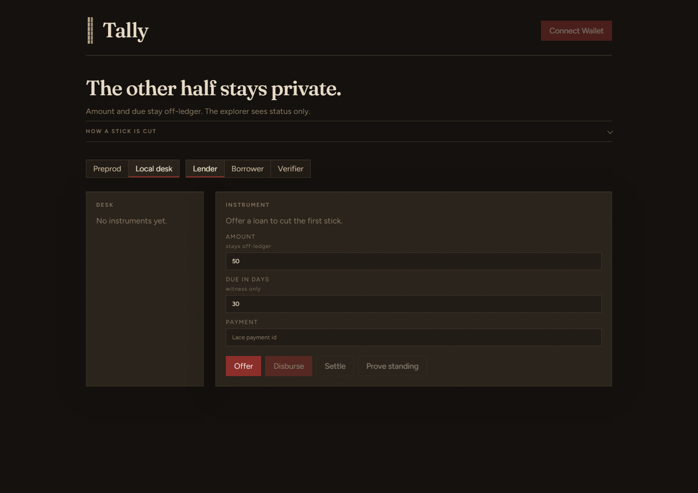
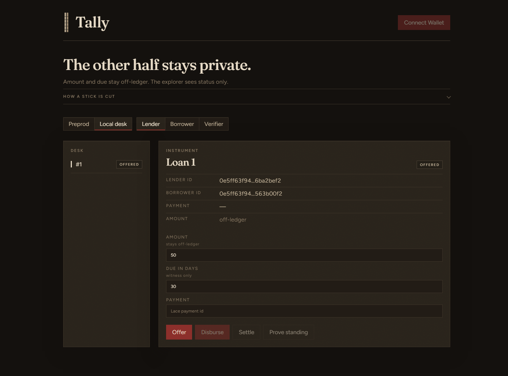
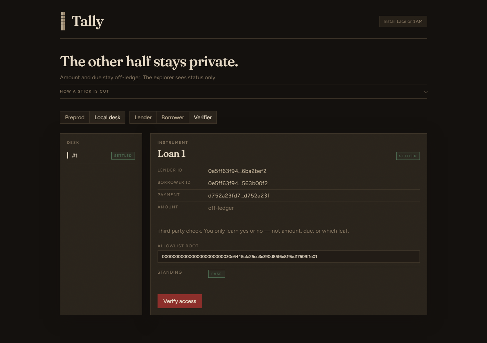

# Tally

Private bilateral loan origination on Midnight. Amount and due date stay in witnesses. The public ledger stores loan id, status, pseudonymous identity grains, a payment commitment, a relationship Merkle allowlist, and nullifiers.

**Private Allowlist Access (L3 / Turn):** settled loans mint a relationship leaf. A party proves membership (`proveStanding`) to a third-party verifier who learns **yes or no only** — not which leaf, amount, or counterparty.

Product name stays **Tally**. Full product write-up: [`PROPOSAL.md`](PROPOSAL.md). Turn notes: [`notes/turn-proposal.md`](notes/turn-proposal.md). Form paste: [`notes/idea-submission.md`](notes/idea-submission.md).

[](https://github.com/Preciousbas/tally/actions/workflows/ci.yml)

## Contract Address

| Network | Address |
|---|---|
| Midnight Preprod | `f8287add7fd6628c414dc876cb29a619694ecccb859bae5f0036c5dfb821b59e` |

Deployed from Lace on Preprod (see [`notes/l1.md`](notes/l1.md)). Desk path: Connect Wallet → Join → paste the address above. Or Deploy from Lender and share the new address with Borrower.

## Live demo

- **Vercel:** https://tally-jet-mu.vercel.app
- **Local desk (recommended for allowlist demo):** `npm run dev --workspace leaderboard-ui -- --mode preprod` then switch to **Local desk**.

## Demo

Demo video (wallet connect + successful circuit call):

- **Video:** *[paste public Loom / YouTube / Drive link after recording — see `pitch/DEMO_SCRIPT.md`]*
- **Script:** [`pitch/DEMO_SCRIPT.md`](pitch/DEMO_SCRIPT.md)

Required coverage for Level 2 judges:

1. Lace / 1AM wallet connect on the desk
2. At least one successful circuit call (Offer on Local desk, or full Offer → Settle → Prove standing → Verifier Pass)

## UI Screenshots









## Privacy model

What an **observer** (explorer, indexer, unrelated wallet) **can** learn:

- That a loan id exists and its **status** (Offered → Accepted → Funded → Repaid → Settled)
- Pseudonymous identity grains (`lenderPk`, `borrowerPk`) — not Lace display names or legal identity
- That a **payment commitment** was bound at disbursement
- The **Merkle root** (and history) of the relationships allowlist
- That a **nullifier** was consumed at settle

What an observer **cannot** learn:

- Loan **amount**
- **Due** date / slot
- User **secret** and **PIN**
- Which **leaf** corresponds to which real-world relationship when only a membership proof is presented
- The economic terms of any prior loan used for standing

What a **membership verifier** learns:

- Boolean: the prover is in the settled-relationship allowlist for this contract (at a stated root)
- Nothing about amount, due, or which leaf / index / counterparty pair was used

Grounded in Compact (`contract/tally.compact`): public `LoanPublic` vs witnesses; settle writes `relationshipLeaf` + `settleNullifier`; `proveStanding` checks a Merkle path against `relationships` without disclosing the leaf.

Desk copy reinforces the same split: amount and due are labeled off-ledger / witness-only; instrument rows show `Amount: off-ledger`; Verifier copy states yes/no only.

## Engineering

Compact contract: [`contract/tally.compact`](contract/tally.compact)

- Dual ledger: public `LoanPublic` vs witnesses `getUserSecret`, `getPin`, `getLoanAmount`, `getDueSlot`
- Identity from secret + PIN (`tally:user:pk:v1`). Does not use `ownPublicKey()`
- Disburse binds a payment grain. Amount is never disclosed
- Settle inserts a relationship leaf and a nullifier
- `proveStanding` — Private Allowlist Access against `relationships` (HistoricMerkleTree)

## How judges test

1. Node 22+, Docker Compose v2, Compact toolchain 0.31 (`compact --version`)
2. Lace on Preprod. Faucet tNIGHT, generate tDUST. Proof server `http://localhost:6300` for local proving
3. Two Chrome profiles (Lender / Borrower); use desk **Verifier** role as the third profile
4. `npm install`
5. `compact compile +0.31.1 tally.compact managed/tally` from `contract/`
6. `npm test` (≥10 tests, including proveStanding happy path + rejects)
7. UI: `npm run dev --workspace leaderboard-ui -- --mode preprod`
8. **Local desk proveStanding:** Offer → Borrower Accept → Lender Disburse → Borrower Repay → Settle → **Prove standing** → switch to **Verifier** → **Verify access** (Pass seal, no amount shown)
9. Preprod: Join the Contract Address above (or Deploy from Lender), same five loan steps. Paste a real Lace tx id into payment reference before Disburse

## Setup

```bash
nvm use 22
npm install
cd contract && compact compile +0.31.1 tally.compact managed/tally && npm test
cd .. && npm run dev --workspace leaderboard-ui -- --mode preprod
```

Install Compact:

```bash
curl --proto '=https' --tlsv1.2 -LsSf https://github.com/midnightntwrk/compact/releases/latest/download/compact-installer.sh | sh
compact update 0.31.1
```

Preprod faucet: https://midnight-tmnight-preprod.nethermind.dev/

## QA

`npm test` runs Compact-logic simulation tests (identity, loan lifecycle, nullifier replay, **proveStanding** membership / non-member / wrong root).

CI: `.github/workflows/ci.yml` — `npm install` + `npm test` on push/PR to `main`.

## Product

Credit is a pairwise instrument, not a bureau score. Privacy is the product: the explorer cannot see amount. Standing proofs answer only allowlist membership.

## Non-goals

- Credit bureau / third-party score issuance
- Web2 attestors (KYC, bank statements, off-chain oracles)
- Marketplace of loans or public order book
- Revealing amounts under any transparency mode
- Mainnet launch
- Defaulted / liquidation flows
- Replacing Lace/1AM identity with real-world legal identity
- General-purpose credential wallet (no W3C VC format in MVP)
- Proving *which* prior counterparty you dealt with (that would break allowlist privacy)

`proveStanding` is **in scope** (Private Allowlist Access).

## Vercel deploy

```bash
# from repo root, logged into Vercel CLI for your account
npx vercel link   # link to Preciousbas/tally project if needed
npx vercel --prod --yes
```

`vercel.json` builds workspaces and serves `leaderboard-ui/dist`. Set `VITE_DEFAULT_CONTRACT` / `VITE_NETWORK_ID=preprod` in the Vercel project env if joining the L1 Preprod address by default.

If CLI auth is missing: open https://vercel.com/new and import `Preciousbas/tally`, root directory `.`, override build with the commands in `vercel.json`. After deploy, replace the Live demo URL above with the real production host.

## License

Apache-2.0 for Midnight-related code in this repository.
