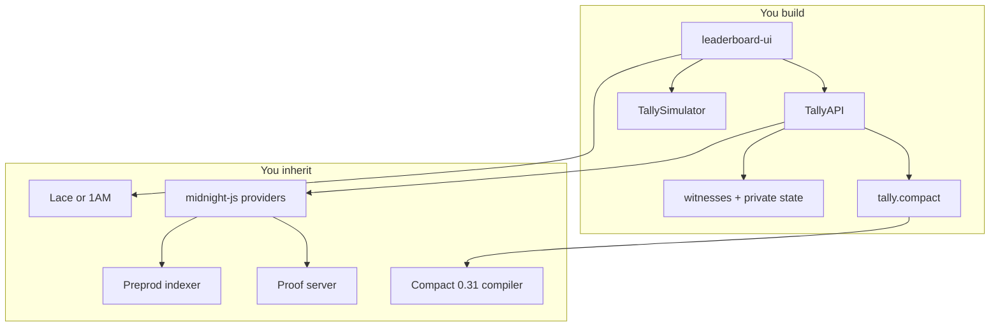

# Architecture

> Four packages. What Midnight already runs, and what this repo implements.

Tally is a workspace of four pieces. Workspace names still say `leaderboard-*` from the Midnight template. The product contract is `tally.compact`.

```
leaderboard-ui   React desk (Lace / 1AM, Local + Preprod, Lender / Borrower / Verifier)
api              Contract glue and witnesses
contract         tally.compact — offerLoan, acceptLoan, disburse, repay, settle, proveStanding
proof-server     Local proving for Preprod flows
```



## What you inherit

Midnight already provides:

- Compact language and `compact compile`
- Proof server (`midnightntwrk/proof-server`, Preprod)
- Indexer GraphQL (`indexer.preprod.midnight.network`)
- Wallet connector API v4 (Lace, 1AM)
- `midnight-js` providers: ZK config, HTTP proofs, indexer public data, contract deploy/join

The desk does not host a custom chain, indexer, or proving backend.

## What you build

| Package | Owns |
| --- | --- |
| `contract/tally.compact` | Public ledger shape, six circuits, identity and leaf domains |
| `contract/src/witnesses.ts` | Private state: secret, PIN, amount, due, standing inputs |
| `contract/src/tally-simulator.ts` | In-browser / Vitest stand-in for those circuits |
| `api/src/index.ts` | `TallyAPI`: `deploy`, `join`, `offerLoan`, `acceptLoan`, `disburse`, `repay`, `settle`, `proveStanding` |
| `leaderboard-ui` | Desk UI, wallet detect, Local vs Preprod, roles, Desk ID |
| `leaderboard-ui/src/deskId.ts` | Compact-hashed Desk ID and relationship leaf for Preprod |
| `proof-server/Dockerfile` | Local prover image pin |

## Request path on Preprod

1. Desk Connect → Lace/1AM `connect('preprod')`
2. Join or Deploy → `BrowserTallyManager` builds providers (wallet prover URI, indexer, in-memory private state)
3. Circuit action → `TallyAPI` writes witnesses (`withTerms` / `withStanding`) then `callTx.<circuit>`
4. Wallet proves and submits
5. `useTally` polls indexer GraphQL `contractAction(address)` every 15s, deserializes `Tally.ledger`, lists `LoanPublic` rows and allowlist roots

Local desk skips 1–5 and calls `TallySimulator` in the page.

## Public vs private state

Public `LoanPublic`: `status`, `lenderPk`, `borrowerPk`, `paymentCommit`.

Private `TallyPrivateState`: `secretKey`, `pin`, `loanAmount`, `dueSlot`, `standingLoanId`, `standingCounterpartyPk`, `standingLeaf`.

The browser private-state provider is in-memory, scoped to the joined contract address. Join re-seeds from the Desk ID secret. If that store is missing, the desk asks you to Join again.

## Env the desk reads

From `leaderboard-ui/.env.preprod`:

| Variable | Role |
| --- | --- |
| `VITE_NETWORK_ID` | `preprod` |
| `VITE_INDEXER_URL` | Indexer GraphQL |
| `VITE_INDEXER_WS_URL` | Indexer websocket |
| `VITE_DEFAULT_CONTRACT` | Published Preprod address |
| `VITE_PROOF_SERVER_URL` | Present in env; runtime proving uses the wallet's `proverServerUri` |

## Hosting

`vercel.json` builds `contract`, `api`, and `leaderboard-ui`, and serves `leaderboard-ui/dist`. That is the **desk**, not this documentation site. Docs preview and deploy are separate — see [Contributing](/contributing).

## Next steps


  - [Contract reference](/contract) — Circuit signatures, ledger, domains.
  - [Contributing](/contributing) — Compile, test, and run from a clean clone.
