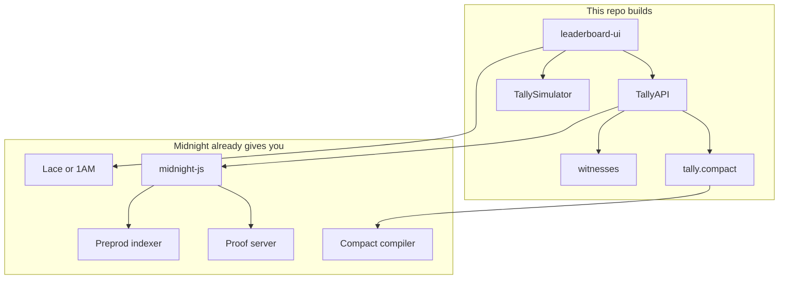

Tally lives in four workspace folders. Some folder names still say `leaderboard` because the project started from a Midnight template. The product contract file is `tally.compact`.

```
leaderboard-ui   The React desk you open in a browser
api              Glue that calls the contract
contract         tally.compact and tests
proof-server     Docker pin for a local prover
```



## What Midnight already runs

- Compact compiler
- Proof server image for Preprod
- Public indexer (reads chain state over GraphQL)
- Wallet connector for Lace and 1AM
- midnight-js helpers for proofs and contract calls

You do not host your own chain.

## What this repo adds

| Piece | Job |
| --- | --- |
| `contract/tally.compact` | The six loan circuits and the public ledger shape |
| `contract` witnesses and simulator | Private inputs and the Local desk stand-in |
| `api` TallyAPI | deploy, join, and each circuit call |
| `leaderboard-ui` | Screens, roles, Desk ID, Local vs Preprod |
| `proof-server/Dockerfile` | Local prover version pin |

## What happens on a Preprod click

1. You Connect a wallet on Preprod
2. You Join (or Deploy) a contract address
3. The desk writes private witnesses, then asks the wallet to prove and submit
4. The UI refreshes loan rows from the indexer

Local desk skips the wallet and indexer. It calls the in-browser simulator instead.

## Private state in the browser

Private loan terms sit in memory for the joined contract. If that store is missing after a long session, Join again.

## Desk hosting vs docs hosting

- **Desk:** Vercel builds the UI ([https://tally-jet-mu.vercel.app](https://tally-jet-mu.vercel.app))
- **Docs:** Mintlify reads this repo’s `docs/` folder. See [Contributing](/docs/contributing)

## Next

<CardGroup cols={2}>
  <Card title="Contract reference" href="/docs/contract">
    Each circuit and the public ledger fields.
  </Card>
  <Card title="Contributing" href="/docs/contributing">
    Compile, test, and run from a clean clone.
  </Card>
</CardGroup>
