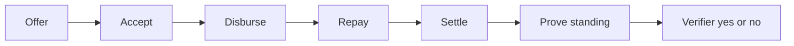

# How it works

> Offer → Accept → Disburse → Repay → Settle → Prove standing.

Every Tally instrument is one bilateral loan. The desk and the Compact circuits share the same six steps. Amount and due are checked in-circuit, then left in witnesses. Status is what an explorer can see. Amount never appears on `LoanPublic`.

The desk flap (`How a stick is cut`) lists the same notches. It is not a route and not a modal.

## Status seals

`LoanStatus` in `contract/tally.compact`:

| Status | After | Public `LoanPublic` |
| --- | --- | --- |
| Vacant | Unused slot | — |
| Offered | `offerLoan` | `lenderPk`, `borrowerPk`, empty `paymentCommit` |
| Accepted | `acceptLoan` | Same identities, still no payment grain |
| Funded | `disburse` | `paymentCommit` bound; amount still absent |
| Repaid | `repay` | Status only |
| Settled | `settle` | Leaf in `relationships`, nullifier consumed |

Instrument rows on the desk always show **Amount: off-ledger**.

## Offer

Who: **Lender**.

The lender supplies amount and due as witnesses (`getLoanAmount`, `getDueSlot`). The circuit asserts both are positive and that the lender is not offering to their own key. `nextId` increments. The new `LoanPublic` row stores only identities and `Offered`.

On Local desk the borrower key is the built-in demo borrower. On Preprod you paste the borrower's **Desk ID** (64 hex), not a Lace or 1AM address.

## Accept

Who: **Borrower**.

`acceptLoan(loanId)` derives the caller's Desk ID from secret + PIN and asserts it equals `loan.borrowerPk`. Status must already be `Offered`. A stranger or the originating lender cannot accept.

## Disburse

Who: **Lender**.

`disburse(loanId, paymentCommit)` binds a 32-byte payment grain. The grain must be non-zero. The amount does not appear in the public struct. On Preprod the desk hashes a Lace payment id (or a local stand-in) into that grain. Status becomes `Funded`.

## Repay

Who: **Borrower**.

`repay(loanId)` requires `Funded` and the borrower key. Status becomes `Repaid`. No amount is written.

## Settle

Who: **Lender or Borrower**.

`settle(loanId)` requires `Repaid` and a party to the loan. It:

1. Builds `settleNullifier` over domain `tally:nul:v1`, loan id, and both public keys
2. Rejects if that nullifier is already in `nullifiers`
3. Inserts `relationshipLeaf` (domain `tally:rel:v1:repaid`) into `relationships` (`HistoricMerkleTree<10>`)
4. Sets status to `Settled`

A second settle on the same pair does not succeed. The nullifier check fails closed.

## Prove standing

Who: **Lender or Borrower** of a settled loan, then a **Verifier**.

`proveStanding()` rebuilds the leaf privately from the caller's key, `getStandingLoanId`, and `getStandingCounterpartyPk`. It checks the Merkle path from `getRelationshipPath` against `relationships.checkRoot`. The public transcript is a root check. The leaf, loan id, amount, and counterparty pairing stay in witnesses.

On the desk:

1. A party clicks **Prove standing** after Settled
2. The desk copies the allowlist root
3. Switch to **Verifier**, paste the root, **Verify access**
4. Seal is **Pass** or **Fail** — no amount, no leaf

Local desk verifies against the in-memory simulator root history. Preprod verifies the pasted root against the current and historic roots read from the indexer.

## Next steps

  - [Privacy](/privacy) — Visible / not visible / what a verifier learns.
  - [Standing](/concepts/standing) — Leaf, root, and the boolean check.
