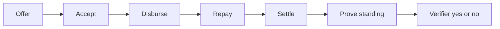

Every Tally loan is between two people. The desk and the Compact contract share the same six steps. **Compact** is Midnight’s language for private smart contracts. A **circuit** is one named action in that contract.

Amount and due are checked inside the proof. They stay in witnesses. Status is what an explorer can see.

On the desk, the wooden flap labeled **How a stick is cut** lists the same steps. It is a help panel, not a separate page.

## Status seals

Each loan carries a seal. The seal is the public status.

| Seal | After this action | What the public row holds |
| --- | --- | --- |
| Vacant | Empty slot | — |
| Offered | Offer | Lender and borrower Desk IDs |
| Accepted | Accept | Same identities |
| Funded | Disburse | Plus a payment commitment |
| Repaid | Repay | Status only |
| Settled | Settle | Leaf added to the allowlist |

Instrument rows always show **Amount: off-ledger**.

## Offer

Who clicks: **Lender**.

The lender sets amount and due as private witnesses. The circuit checks that both are greater than zero and that you are not lending to yourself. A new loan id is created. The public row shows Offered.

On Local desk the borrower is built in. On Preprod you paste the borrower’s **Desk ID**.

## Accept

Who clicks: **Borrower**.

Only the Desk ID named in the offer can accept. The seal becomes Accepted.

## Disburse

Who clicks: **Lender**.

Disburse means “record that payout happened.” You pass a **payment commitment**. That is a 32-byte sealed mark. It is not the amount. The seal becomes Funded.

## Repay

Who clicks: **Borrower**.

The seal becomes Repaid. No amount is written to the chain.

## Settle

Who clicks: **Lender or Borrower**.

Settle closes the loan after Repaid. The contract:

1. Builds a **nullifier** (a one-time ticket) so the same settle cannot run twice
2. Inserts a **relationship leaf** into the allowlist tree
3. Sets the seal to Settled

## Prove standing

Who clicks: a party to a Settled loan, then a **Verifier**.

**Prove standing** builds a membership proof. That means “show I belong on the allowlist without showing which leaf.” The desk copies an allowlist **root** (a fingerprint of the guest list). The Verifier pastes that root and clicks **Verify access**. The seal is Pass or Fail.

## Next

<CardGroup cols={2}>
  <Card title="Privacy" href="/docs/privacy">
    What stays secret at each step.
  </Card>
  <Card title="Desk tour" href="/docs/desk-tour">
    Screenshots and the three roles.
  </Card>
</CardGroup>
