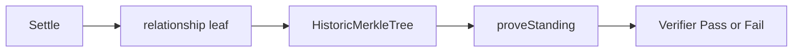

# Standing

> A membership proof answers yes or no. It does not name a leaf, amount, or counterparty.

Settled loans mint a relationship leaf into `relationships`. Later, a party proves they sit on that allowlist. A verifier learns a boolean at a stated Merkle root. The verifier does not learn which loan, which leaf index, or any economic term.

This is Private Allowlist Access. It is not a credit score and not a proof of *which* prior counterparty you dealt with.

## At a glance

| Piece | Role | Result |
| --- | --- | --- |
| `relationshipLeaf` | Hash of domain `tally:rel:v1:repaid`, loan id, both Desk IDs | Inserted at settle |
| `relationships` | `HistoricMerkleTree<10, Bytes<32>>` | Current root plus history |
| `proveStanding` | Rebuilds the leaf in witnesses; checks a Merkle path | Public transcript is a root check |
| Verifier | Pastes a root; desk compares to known roots | Pass or Fail only |

## How it works

Plain path on the desk:

1. Status must be **Settled**
2. Lender or Borrower clicks **Prove standing**
3. The desk copies the allowlist root
4. **Verifier** pastes that root and clicks **Verify access**

Mechanism: `proveStanding()` takes no public arguments. Witnesses supply `getStandingLoanId`, `getStandingCounterpartyPk`, and `getRelationshipPath`. The circuit rebuilds the leaf as lender and as borrower, asserts the path leaf matches one of those, then `relationships.checkRoot`. Failures include `"not a party leaf"` and `"not on allowlist"`.

On Preprod the desk derives the leaf with Compact `_relationshipLeaf_0` in `deskId.ts`. It does not use `TallySimulator`'s toy hash for that path. Local desk checks the simulator's in-memory root history.

## Verify access

The desk **Verifier** role is the membership check. You paste an allowlist root from a standing proof. **Verify access** returns **Pass** or **Fail**. The panel does not show amount, due, or which leaf.

This is not a KYC attestor and not a score issuer. It answers one question: is this identity in the settled-relationship allowlist at a stated root?

| | Local desk | Preprod |
| --- | --- | --- |
| Who proves | Lender or Borrower on the same browser | A party whose Desk ID is on the settled loan |
| Root source | Simulator historic roots | Indexer `relationships.root()` plus history |
| Check | `TallySimulator.verifyStanding` | Pasted root equals a known on-chain root (case-insensitive) |

Disambiguation: **Prove standing** is a party action. **Verify access** is the third-party action. Switch the role segment to Verifier after the root is copied.

1. Complete Offer → Settle on [Local desk](/quickstart) or [Preprod](/preprod)
2. As Lender or Borrower, **Prove standing**
3. Copy **Allowlist root**
4. Switch to **Verifier**
5. Paste the root if it is not already filled
6. **Verify access**

Pass seal is moss (`Settled` token). Fail is vacant. Wrong root copy: `Allowlist root does not match.`

## What is public vs private

| Public | Private |
| --- | --- |
| Allowlist Merkle root (and historic roots) | Which leaf was used |
| That `proveStanding` succeeded or failed | Amount, due, counterparty pairing |
| Loan status `Settled` | User secret and PIN |

## Guarantee

A membership verifier learns **yes or no only**. The proof does not disclose amount, due, leaf index, or which counterparty pair minted the leaf.

## Next steps

  - [Privacy](/privacy) — Visible / not visible / what a verifier learns.
  - [Contract](/contract) — `proveStanding` and the allowlist ledger.
